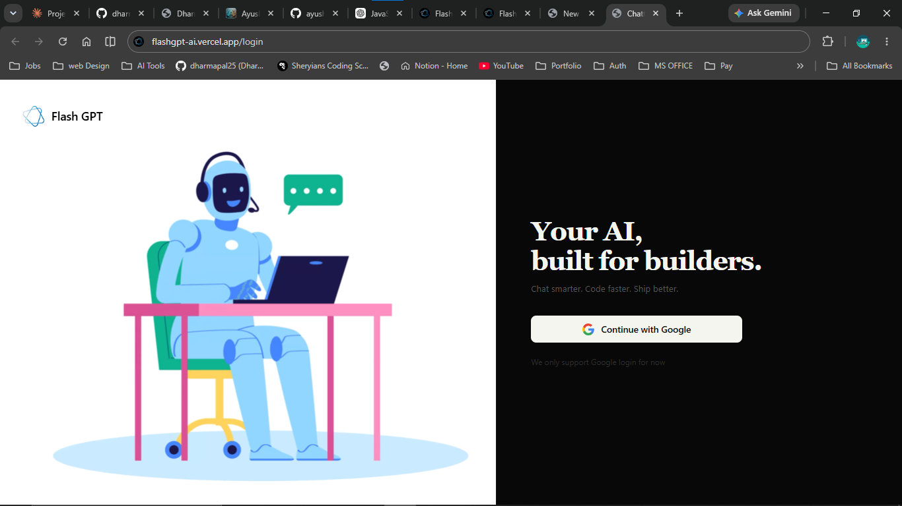
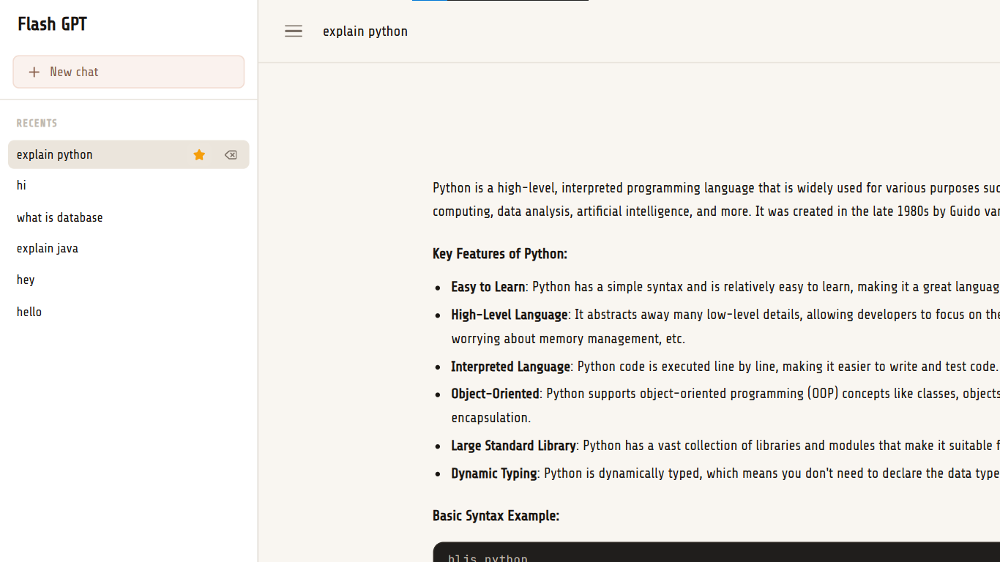
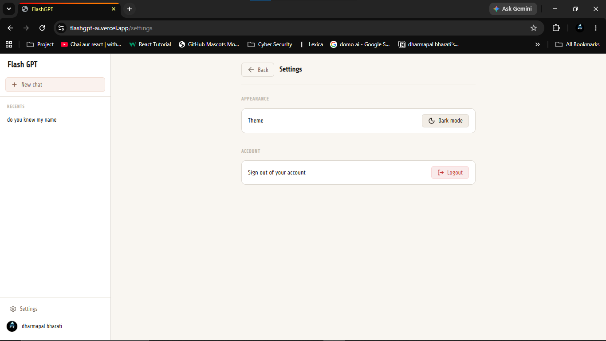

<div align="center">


# FlashGPT

**Your AI, built for builders.**

*Chat smarter. Code faster. Ship better.*

[](https://flashgpt-ai.vercel.app)


</div>

---

## What is FlashGPT?

FlashGPT is a full-stack AI chat assistant that helps developers think faster, code better, and ship smarter — powered by **Groq AI** with long-term memory using **Pinecone vector search**.

Built with a dark-first design, it supports **Google OAuth login**, persistent **chat history**, and beautifully renders **markdown + code blocks** in responses.

---

## 🚀 Live URLs

| Service  | URL |
|----------|-----|
| Frontend | [flashgpt-ai.vercel.app](https://flashgpt-ai.vercel.app) |
| Backend  | [flashgptai.onrender.com](https://flashgptai.onrender.com) |

---

## 📸 Screenshots

### login

### Conversation

### Features

### Logout


---

## ✨ Features

- AI responses powered by **Groq**
-  **Google OAuth** login with session support
-  Persistent **chat history** with saved conversations
-  Bookmark and delete chat support
-  **Memory search** using embeddings + Pinecone
-  **Markdown rendering** for assistant responses
-  **Code block** rendering with syntax highlighting
-  Fully **responsive** React UI
-  **PWA-ready** frontend setup

---

## 🛠️ Tech Stack

**Frontend**
React · Vite · React Router · Axios · Lucide React · React Markdown · Remark GFM · Rehype Highlight · Vite PWA

**Backend**
Node.js · Express.js · MongoDB · Mongoose · Passport Google OAuth 2.0 · Express Session · Connect Mongo · Groq SDK · Google GenAI Embeddings · Pinecone

**Deployment**
Frontend → Vercel · Backend → Render

---

## ⚙️ Installation

**1. Clone the repo**
```bash
git clone https://github.com/dharmapal25/FlashGPT.git
cd FlashGPT
```

**2. Install backend dependencies**
```bash
cd backend
npm install
```

**3. Install frontend dependencies**
```bash
cd ../frontend
npm install
```

**4. Start the backend**
```bash
cd ../backend
npm start
```

**5. Start the frontend**
```bash
cd ../frontend
npm run dev
```

---

## 🔐 Environment Variables

Create `backend/.env`:
```env
GROQ_API_KEY=your_groq_api_key
GROQ_AI_MODEL=groq/compound
PORT=3000

GOOGLE_CLIENT_ID=your_google_client_id
GOOGLE_CLIENT_SECRET=your_google_client_secret
GOOGLE_CALLBACK_URL=https://flashgptai.onrender.com/auth/google/callback
GOOGLE_API_KEY=your_google_api_key

SESSION_SECRET=your_session_secret
MONGO_URI=your_mongodb_connection_string
PINECONE_API_KEY=your_pinecone_api_key

FRONTEND_URL=https://flashgpt-ai.vercel.app
REFRESH_TOKEN_SECRET=your_refresh_token_secret
ACCESS_TOKEN_SECRET=your_access_token_secret
```

Create `frontend/.env`:
```env
VITE_BACKEND_URL=https://flashgptai.onrender.com
```

---

## 📁 Folder Structure

```text
.
├── backend
│   ├── src
│   │   ├── config
│   │   ├── controllers
│   │   ├── middleware
│   │   ├── models
│   │   ├── Routers
│   │   ├── services
│   │   └── utils
│   ├── package.json
│   └── server.js
├── frontend
│   ├── Public
│   ├── src
│   │   ├── components
│   │   ├── context
│   │   ├── pages
│   │   ├── routes
│   │   ├── services
│   │   └── style
│   └── package.json
└── README.md
```

---

## 👤 Author

<div align="center">

**Dharmapal (Flash)**

[](https://flash-devs.vercel.app)
[](https://github.com/dharmapal25)
[](https://linkedin.com/in/dharmapal25)

</div>

---

<div align="center">

Built with ❤️ by Dharmapal 

</div>