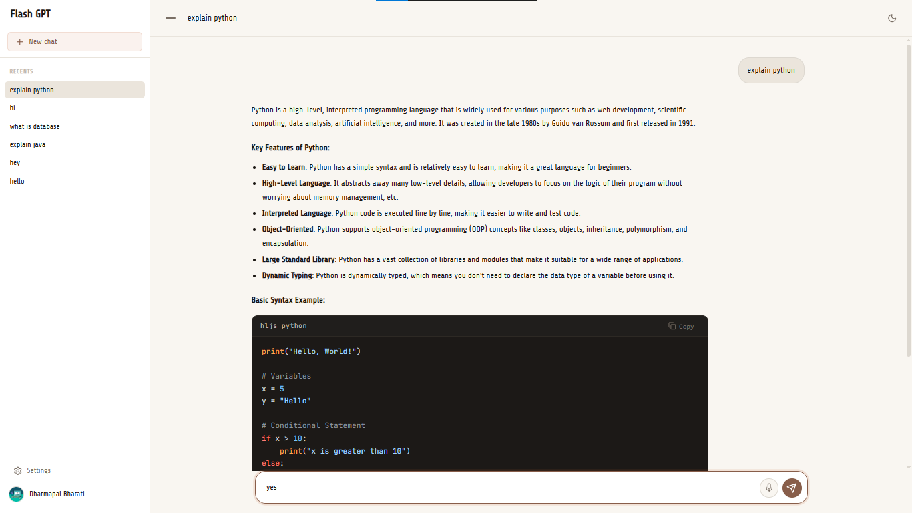

# FlashGPT

AI chat application with Google login, persistent chat history, memory search, and a clean React interface.


## Live Demo + Screenshot

## Live URLs

- Frontend: `https://flashgpt-ai.vercel.app`
- Backend: `https://flashgptai.onrender.com`
- Google callback: `https://flashgptai.onrender.com/auth/google/callback`



## Features

- AI chat responses powered by Groq.
- Google OAuth login with session support.
- Chat history with saved conversations.
- Bookmark and delete chat support.
- Memory search using embeddings and Pinecone.
- Markdown rendering for assistant responses.
- Code block rendering with syntax highlighting.
- Responsive React UI.
- PWA-ready frontend setup.

## Tech Stack

**Frontend**

- React
- Vite
- React Router
- Axios
- Lucide React
- React Markdown
- Remark GFM
- Rehype Highlight
- Vite PWA

**Backend**

- Node.js
- Express.js
- MongoDB
- Mongoose
- Passport Google OAuth 2.0
- Express Session
- Connect Mongo
- JSON Web Token
- Groq SDK
- Google GenAI embeddings
- Pinecone

**Deployment**

- Frontend: Vercel
- Backend: Render

## Installation

1. Clone the repository.

```bash
git clone https://github.com/dharmapal25/FlashGPT.git
cd FlashGPT
```

2. Install backend dependencies.

```bash
cd backend
npm install
```

3. Install frontend dependencies.

```bash
cd ../frontend
npm install
```

4. Start the backend.

```bash
cd ../backend
npm start
```

5. Start the frontend.

```bash
cd ../frontend
npm run dev
```

## Env Variables

Create `backend/.env`:

```env
GROQ_API_KEY=your_groq_api_key
GROQ_AI_MODEL=groq/compound
PORT=3000

GOOGLE_CLIENT_ID=your_google_client_id
GOOGLE_CLIENT_SECRET=your_google_client_secret
GOOGLE_CALLBACK_URL=https://flashgptai.onrender.com/auth/google/callback
GOOGLE_API_KEY=your_google_api_key

SESSION_SECRET=your_session_secret
MONGO_URI=your_mongodb_connection_string
PINECONE_API_KEY=your_pinecone_api_key

FRONTEND_URL=https://flashgpt-ai.vercel.app
REFRESH_TOKEN_SECRET=your_refresh_token_secret
ACCESS_TOKEN_SECRET=your_access_token_secret
```

Create `frontend/.env`:

```env
VITE_BACKEND_URL=https://flashgptai.onrender.com
```

## Folder Structure

```text
.
|-- backend
|   |-- src
|   |   |-- config
|   |   |-- controllers
|   |   |-- middleware
|   |   |-- models
|   |   |-- Routers
|   |   |-- services
|   |   `-- utils
|   |-- package.json
|   `-- server.js
|-- frontend
|   |-- Public
|   |-- src
|   |   |-- components
|   |   |-- context
|   |   |-- pages
|   |   |-- routes
|   |   |-- services
|   |   `-- style
|   `-- package.json
`-- README.md
```

## Author/Contact

**Flash**

- Frontend: `https://flashgpt-ai.vercel.app`
- Backend: `https://flashgptai.onrender.com`
